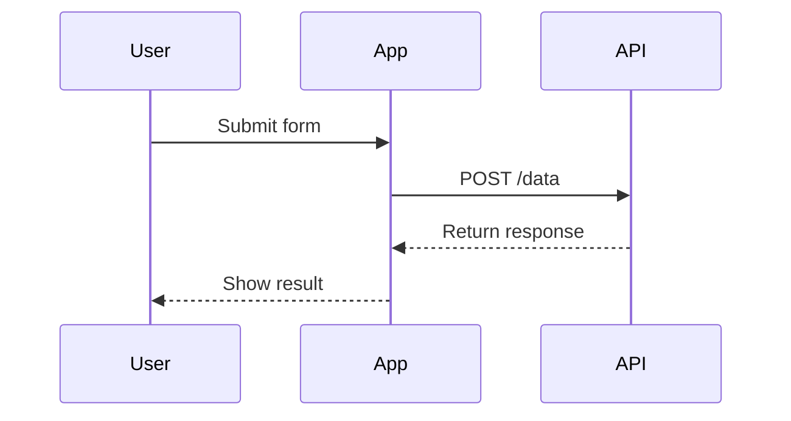

::alert{type="info"}
This is a Nuxt Content alert component with **markdown support**!
::

## Nuxt Content Features

### Code Blocks with Highlighting

```js [server/api/test.js]
// Nuxt Content automatically highlights code
export default defineEventHandler((event) => {
  const query = getQuery(event)
  return { message: `Hello ${query.name || 'World'}!` }
})
```

```css [styles.css]
/* Style testing */
.container {
  margin: 0 auto;
  max-width: 1200px;
  @apply px-4;
}
```

### Prose Components
Use the built-in components:
::code-group
  ```bash [npm]
  npm install @nuxt/content
  ```

  ```bash [yarn]
  yarn add @nuxt/content
  ```
::

### Custom Components

<TestComponent :count="5" />

### Table of Contents

[[toc]]


## Content Navigation

Internal link: [About Page](/about)  
External link: [Nuxt Documentation](https://nuxt.com)


## Advanced Markdown

### Mermaid Diagrams



### Vue Components in Markdown

<Counter :initial="0" />

---

## Table Example

| Feature         | Support | Notes                 |
|-----------------|---------|-----------------------|
| Markdown        | ✅       | Full CommonMark       |
| Vue Components  | ✅       | Inline or import      |
| Code Highlight  | ✅       | Prisma supported      |
| Search          | ✅       | Lunr or FlexSearch    |

---

## API Content Query Example

```js
// Example content query
const { data: articles } = await useAsyncData('home', () => {
  return queryContent('/articles')
    .sort({ date: -1 })
    .limit(3)
    .find()
})
```

---

## Callout Blocks

::callout{icon="i-heroicons-information-circle"}
This is a custom callout block with icon support using the `@nuxt/ui` module.
::

::callout{type="warning" icon="i-heroicons-exclamation-triangle"}
Important notice about content formatting!
::

---

## Math Formulas

Inline math: $E = mc^2$

Block math:
$$
\int_{a}^{b} x^2 dx
$$

---

## Task Lists

- [x] Set up Nuxt Content
- [ ] Implement search
- [ ] Add dark mode


This example includes several Nuxt Content-specific features:
1. YAML front matter for metadata
2. Vue components in Markdown
3. Nuxt Content's built-in components (alert, code-group, callout)
4. Mermaid diagram support
5. Content query examples
6. Table of contents generation
7. Icon integration with `@nuxt/ui`
8. Code highlighting with language specification

To use this in your Nuxt Content project:
1. Install required dependencies: `@nuxt/content`, `@nuxtjs/mdc`, and `@nuxt/ui` (for icons)
2. Create a markdown file in your `content/` directory
3. Use the `queryContent()` composable to fetch and display the content
4. Register any custom components in your `components/content/` directory

The content will be automatically parsed and made available through Nuxt Content's API endpoints.